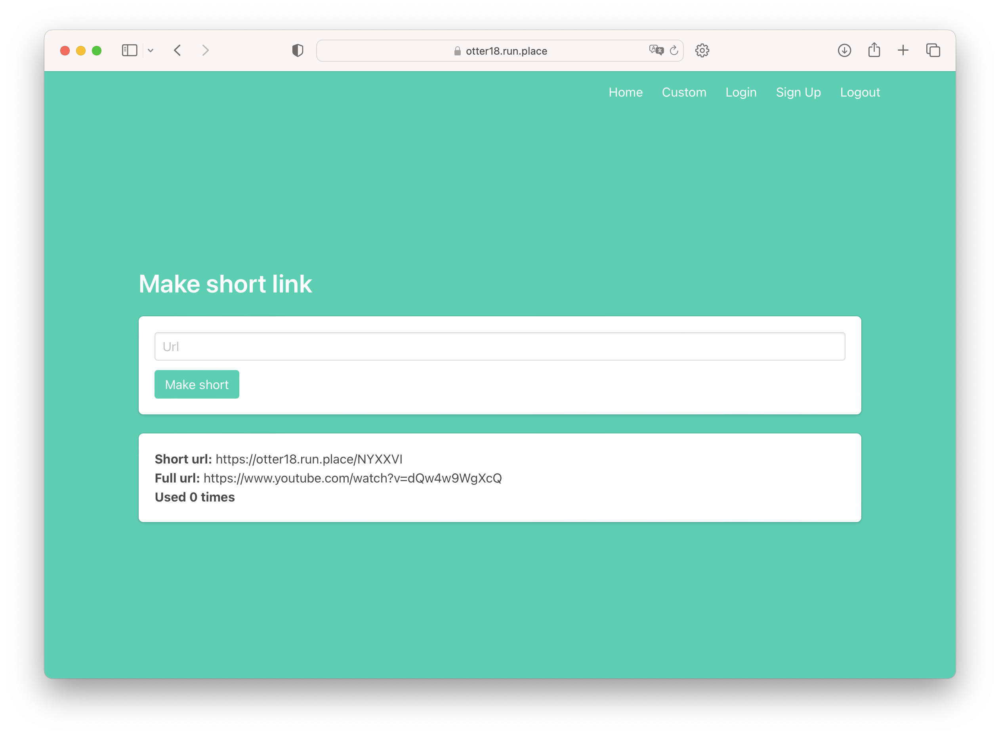
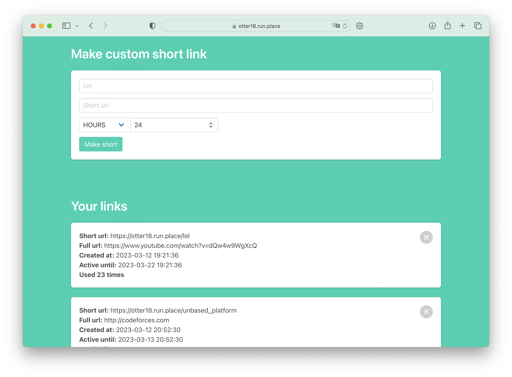

# [Shortener](http://shortener.nasavasa.ru)
### Cервис для сокращения и управления вашими ссылками с функциями аналитики в сопровождении [telegram-бота](https://t.me/hse_shortener_bot).
6 Mar 2023 - 13 Mar 2023


Сервис разработан в рамках экаменационного проекта курса ["Облачные технологии"](https://www.hse.ru/ba/se/courses/494722081.html) в [Высшей Школе Экономики](https://www.hse.ru/) в команде.

## Установка

1. Скопировать репозиторий
```bash
git clone https://github.com/NasaVasa/shortener.nasavasa.ru.git
```
2. Переходим в созданную папку
```bash
cd shortener.nasavasa.ru
````
3. Создать файл .env в корне проекта и заполнить его (пример в .env.example)

4. Запустить контейнеры
```bash 
docker-compose up -d
```
P.S. Так как в проекте используется docker, то для запуска проекта необходимо установить docker и docker-compose

P.P.S. Так как в docker-compose Flask подключается к уже созданной сети nginx-net, то необходимо создать контейнер с nginx, который будет проксировать запросы на Laravel.

## Screenshots





